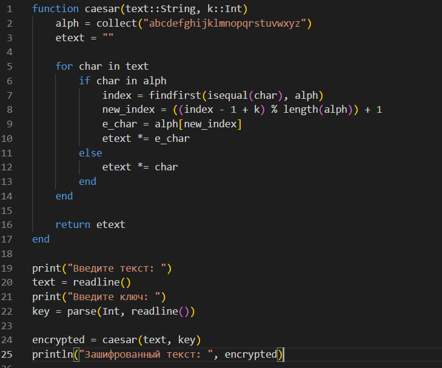

---
## Front matter
lang: ru-RU
title: Шифры простой замены
subtitle: Лабораторная работа №1
author:
  - Данилова А.С.
institute:
  - Российский университет дружбы народов, Москва, Россия
  - Объединённый институт ядерных исследований, Дубна, Россия
date: 01 января 1970

## i18n babel
babel-lang: russian
babel-otherlangs: english

## Formatting pdf
toc: false
toc-title: Содержание
slide_level: 2
aspectratio: 169
section-titles: true
theme: metropolis
header-includes:
 - \metroset{progressbar=frametitle,sectionpage=progressbar,numbering=fraction}
---

## Цели и задачи

- Изучить теоретическую часть
- Реализовать шифр Цезаря и шифр Атбаш.

## Теоретическая часть

Шифр Цезаря (также он является шифром простой замены) - это моноалфавитная подстановка, т.е. каждой букве открытого текста ставится в соответствие одна буква шифртекста. 
На практике при создании шифра простой замены в качестве шифроалфавита берется исходный алфавит, но с нарушенным порядком букв (алфавитная перестановка).

## Теоретическая часть

Шифр Атбаш - это один из древнейших криптографических методов, который был впервые описан в Талмуде и использовался еще в Древнем Вавилоне.
Основная идея шифра Атбаш заключается в замене каждой буквы текста на букву, находящуюся на противоположном конце алфавита. Например, в латинском алфавите 'a' заменяется на 'z', 'b' на 'y', и так далее.

## Выполнение работы

{#fig:001 width=60%}

## Полученный результат

## Выполнение работы

{#fig:002 width=60%}

## Полученный результат

## Выводы

Мы изучили то, как работают два метода шифрования, а также реализовали их самостоятельно на языке программирования Julia.
