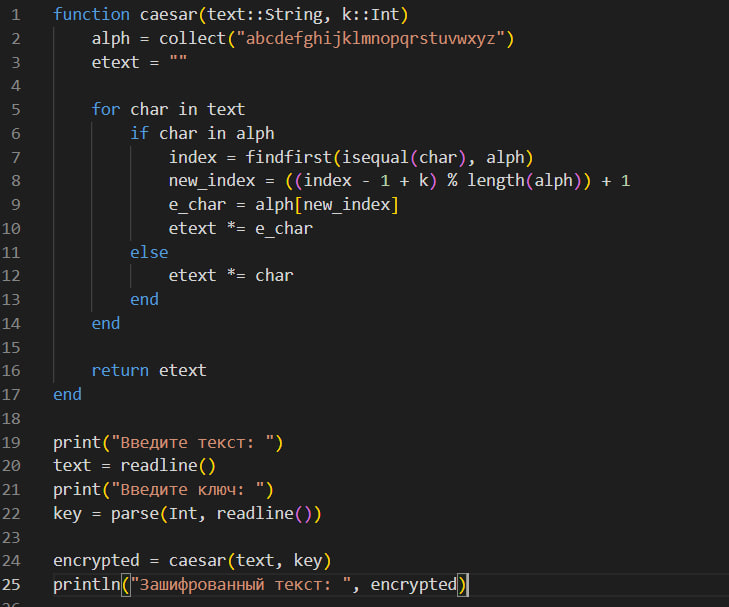
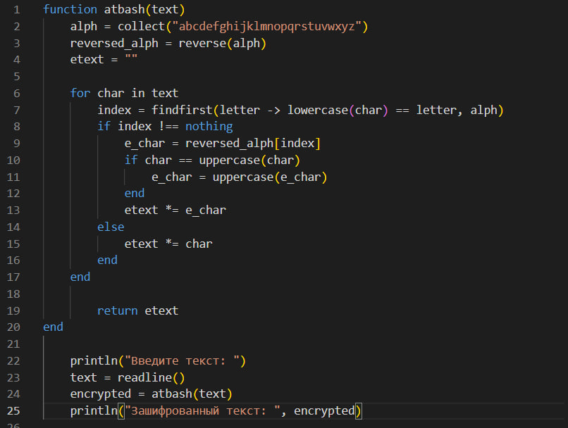
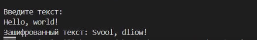

---
## Front matter
title: "Лабораторная работа №1"
subtitle: "Математические основы защиты информации и информационной безопасности"
author: "Данилова Анастасия Сергеевна"

## Generic otions
lang: ru-RU
toc-title: "Содержание"

## Bibliography
bibliography: bib/cite.bib
csl: pandoc/csl/gost-r-7-0-5-2008-numeric.csl

## Pdf output format
toc: true # Table of contents
toc-depth: 2
lof: true # List of figures
lot: true # List of tables
fontsize: 12pt
linestretch: 1.5
papersize: a4
documentclass: scrreprt
## I18n polyglossia
polyglossia-lang:
  name: russian
  options:
	- spelling=modern
	- babelshorthands=true
polyglossia-otherlangs:
  name: english
## I18n babel
babel-lang: russian
babel-otherlangs: english
## Fonts
mainfont: IBM Plex Serif
romanfont: IBM Plex Serif
sansfont: IBM Plex Sans
monofont: IBM Plex Mono
mathfont: STIX Two Math
mainfontoptions: Ligatures=Common,Ligatures=TeX,Scale=0.94
romanfontoptions: Ligatures=Common,Ligatures=TeX,Scale=0.94
sansfontoptions: Ligatures=Common,Ligatures=TeX,Scale=MatchLowercase,Scale=0.94
monofontoptions: Scale=MatchLowercase,Scale=0.94,FakeStretch=0.9
mathfontoptions:
## Biblatex
biblatex: true
biblio-style: "gost-numeric"
biblatexoptions:
  - parentracker=true
  - backend=biber
  - hyperref=auto
  - language=auto
  - autolang=other*
  - citestyle=gost-numeric
## Pandoc-crossref LaTeX customization
figureTitle: "Рис."
tableTitle: "Таблица"
listingTitle: "Листинг"
lofTitle: "Список иллюстраций"
lotTitle: "Список таблиц"
lolTitle: "Листинги"
## Misc options
indent: true
header-includes:
  - \usepackage{indentfirst}
  - \usepackage{float} # keep figures where there are in the text
  - \floatplacement{figure}{H} # keep figures where there are in the text
---

# Цель работы

Изучить теорию и реализовать шифр Цезаря и шифр Атбаш.

# Задание

Реализовать шифр Цезаря с произвольным ключом k и шифр Атбаш.

# Теоретическое введение
**Шифр Цезаря**

Шифр Цезаря (также он является шифром простой замены) - это моноалфавитная подстановка, т.е. каждой букве открытого текста ставится в соответствие одна буква шифртекста. На практике при создании шифра простой замены в качестве шифроалфавита берется исходный алфавит, но с нарушенным порядком букв (алфавитная перестановка). Для запоминания нового порядка букв перемешивание алфавита осуществляется с помощью пароля. В качестве пароля могут выступать слово или несколько слов с неповторяющимися буквами.

Шифровальная таблица состоит из двух строк: в первой записывается
стандартный алфавит открытого текста, во второй - начиная с некоторой позиции размещается пароль (пробелы опускаются), а далее идут в алфавитном порядке оставшиеся буквы, не вошедшие в пароль. В случае несовпадения начала пароля с началом строки процесс после ее завершения циклически продолжается с первой позиции. Ключом шифра служит пароль вместе с числом, указывающим положение начальной буквы пароля.

**Шифр Атбаш**

Шифр Атбаш - это один из древнейших криптографических методов, который был впервые описан в Талмуде и использовался еще в Древнем Вавилоне.

Основная идея шифра Атбаш заключается в замене каждой буквы текста на букву, находящуюся на противоположном конце алфавита. Например, в латинском алфавите 'a' заменяется на 'z', 'b' на 'y', и так далее.

# Выполнение лабораторной работы

Для начала напишем код, который реализует шифр Цезаря.
Основной смысл в том, что мы проходим по каждому символу в исходном тексте "text". Далее проверяем, содержится ли текущий символ в алфавите alph. Если да, то выполняется шифрование, если нет, то символ просто копируется в etext.
Находим индекс текущего символа в алфавите, вычисляем новый индекс символа после применения сдвига k. После мы получаем новый символ из алфавита, используя вычисленный индекс и добавляем каждый новый зашифрованный символ к одной строке etext.

Посмотрим на полученный результат:

Для начала напишем код, который реализует шифр Атбаш. 

Мы проходим по каждому символу в исходном сообщении text.
Далее находим индекс текущего символа в алфавите. Если символ не является буквой, индекс будет равен nothing.
If проверяет, был ли найден индекс символа в алфавите. Если да, то выполняется шифрование, если нет, то символ просто копируется в etext.
Получаем символ из "перевернутого" алфавита, используя найденный индекс.
Если исходный символ был заглавным, то и зашифрованный символ заглавный.
Добавляем зашифрованный символ к строке etext.

Посмотрим на полученный результат:

# Выводы

Мы изучили то, как работают два метода шифрования, а также реализовали их самостоятельно на языке программирования Julia.

# Список литературы{.unnumbered}

1. Шифры простой замены // Математические основы защиты информации и информационной безопасности URL: file:///C:/Users/nastd/Downloads/lab01.pdf
2. Mathematics // Julia URL: https://docs.julialang.org/en/v1/base/math/