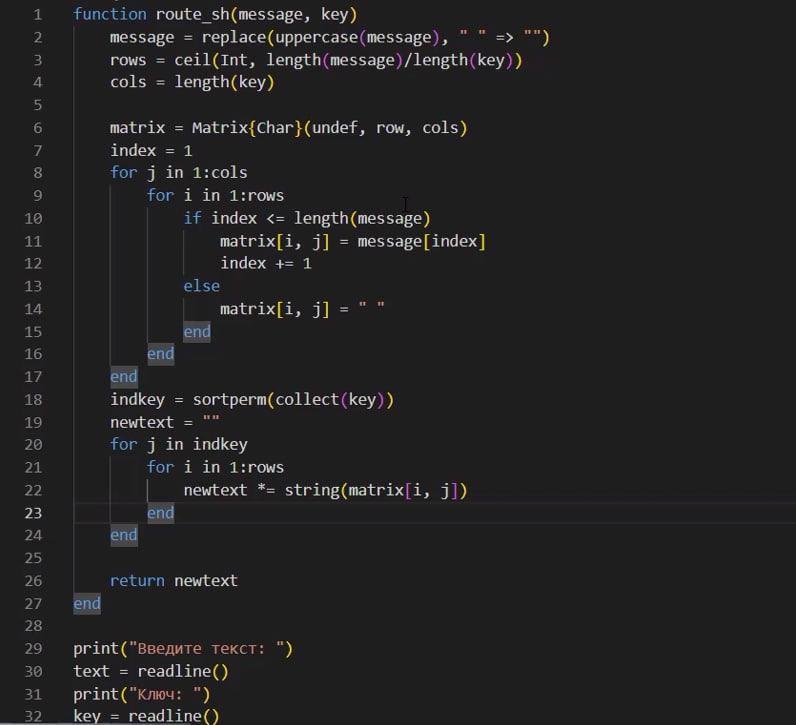
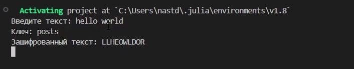
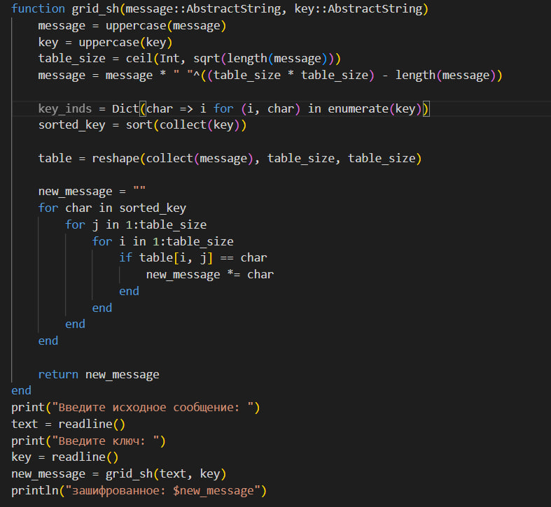
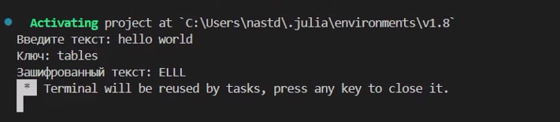
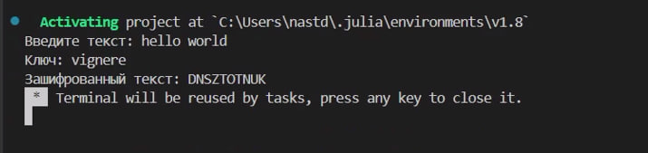

---
## Front matter
title: "Лабораторная работа №2"
subtitle: "Математические основы защиты информации и информационной безопасности"
author: "Данилова Анастасия Сергеевна"

## Generic otions
lang: ru-RU
toc-title: "Содержание"

## Bibliography
bibliography: bib/cite.bib
csl: pandoc/csl/gost-r-7-0-5-2008-numeric.csl

## Pdf output format
toc: true # Table of contents
toc-depth: 2
lof: true # List of figures
lot: true # List of tables
fontsize: 12pt
linestretch: 1.5
papersize: a4
documentclass: scrreprt
## I18n polyglossia
polyglossia-lang:
  name: russian
  options:
	- spelling=modern
	- babelshorthands=true
polyglossia-otherlangs:
  name: english
## I18n babel
babel-lang: russian
babel-otherlangs: english
## Fonts
mainfont: IBM Plex Serif
romanfont: IBM Plex Serif
sansfont: IBM Plex Sans
monofont: IBM Plex Mono
mathfont: STIX Two Math
mainfontoptions: Ligatures=Common,Ligatures=TeX,Scale=0.94
romanfontoptions: Ligatures=Common,Ligatures=TeX,Scale=0.94
sansfontoptions: Ligatures=Common,Ligatures=TeX,Scale=MatchLowercase,Scale=0.94
monofontoptions: Scale=MatchLowercase,Scale=0.94,FakeStretch=0.9
mathfontoptions:
## Biblatex
biblatex: true
biblio-style: "gost-numeric"
biblatexoptions:
  - parentracker=true
  - backend=biber
  - hyperref=auto
  - language=auto
  - autolang=other*
  - citestyle=gost-numeric
## Pandoc-crossref LaTeX customization
figureTitle: "Рис."
tableTitle: "Таблица"
listingTitle: "Листинг"
lofTitle: "Список иллюстраций"
lotTitle: "Список таблиц"
lolTitle: "Листинги"
## Misc options
indent: true
header-includes:
  - \usepackage{indentfirst}
  - \usepackage{float} # keep figures where there are in the text
  - \floatplacement{figure}{H} # keep figures where there are in the text
---

# Цель работы

Изучить шифры перестановки и реализовать их на языке программирования Julia.

# Задание

Реализовать шифры перестановки:
- маршрутное шифрование
- шифрование с помощью решеток
- таблица Виженера

# Теоретическое введение

Шифры перестановки преобразуют открытый текст в криптограмму путем перестановки его символов. Способ, каким при шифровании переставляются буквы открытого текста, и является ключом шифра. Важным требованием является равенство длин ключа и исходного текста.

**Маршрутное шифрование**

Маршрутное шифрование — это способ шифрования, изобретённый французским математиком и криптографом Франсуа Виетом.

Суть метода:

1. Открытый текст последовательно разбивается на части (блоки) с длиной, равной произведению m и n.
2. Блок вписывается построчно в таблицу размерности m × n.
Криптограмма получается выписыванием букв из таблицы в соответствии с некоторым маршрутом. Этот маршрут вместе с числами m и n составляет ключ шифра.

Чаще всего буквы выписывают по столбцам, которые упорядочиваются в соответствии с паролем.

**Шифрование с помощью решеток**

Шифрование с помощью решёток — это способ шифрования, предложенный в 1881 году австрийским криптографом Эдуардом Флейснером.

Процесс шифрования происходит следующим образом: 

1. Выбирается натуральное число k > 1, и квадрат размерности k×k построчно заполняется числами 1, 2, ..., k. 
2. Квадрат поворачивается по часовой стрелке на 90° и размещается вплотную к предыдущему квадрату. Аналогичные действия совершаются ещё два раза, так чтобы в результате из четырёх малых квадратов образовался один большой с длиной стороны 2k. 
3. Далее из большого квадрата вырезаются клетки с числами от 1 до k^2, для каждого числа одна клетка. 
4. Сделанная решётка (квадрат с прорезями) накладывается на чистый квадрат 2k × 2k, и в прорези по строчкам (то есть слева направо и сверху вниз) вписываются первые буквы открытого текста. 
5. Затем решётка поворачивается на 90° по часовой стрелке и накладывается на частично заполненный квадрат, вписывание продолжается. 
6. После третьего поворота, наложения и вписывания все клетки квадрата будут заполнены. Правило выбора прорезей гарантирует, что при заполнении квадрата буква на букву никогда не попадёт.
7. Из заполненного квадрата буквы можно выписать по столбцам, выбрав подходящий пароль.

**Таблица Виженера**

Шифрование с помощью таблицы Виженера основано на том, что каждая буква в исходном шифруемом тексте сдвигается по алфавиту не на фиксированное, а на переменное количество символов. Величина сдвига каждой буквы задаётся ключом (паролем) — секретным словом или фразой, которая используется для шифрования и расшифровки. 

Для шифрования используется так называемый «квадрат Виженера» — таблица, где в каждой строке алфавит сдвигается на одну позицию вправо. Например, если взять строку с первой буквой ключа и столбец с первой буквой исходного текста, то на их пересечении будет первая буква зашифрованного сообщения. Затем процедура повторяется для всех остальных пар букв ключа и исходного сообщения по очереди. 

# Выполнение лабораторной работы

**Маршрутное шифрование**

**Шифрование с помощью решеток**

**Таблица Виженера**

# Выводы

Мы изучили 3 шифра перестановки и реализовали их на языке программирования Julia.

# Список литературы{.unnumbered}

1. Mathematics // Julia URL: https://docs.julialang.org/en/v1/base/math/