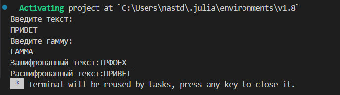

---
## Front matter
lang: ru-RU
title: Шифрование гаммированием
subtitle: Лабораторная работа №3
author:
  - Данилова А.С.

## i18n babel
babel-lang: russian
babel-otherlangs: english

## Formatting pdf
toc: false
toc-title: Содержание
slide_level: 2
aspectratio: 169
section-titles: true
theme: metropolis
header-includes:
 - \metroset{progressbar=frametitle,sectionpage=progressbar,numbering=fraction}
---

## Цели и задачи

Изучить шифрование гаммированием, реализовать алгоритм шифрования гаммированием конечной гаммой на языке программирования Julia.

## Теоретическая часть

**Шифрование гаммированием**

*Гаммирование* - процедура наложения при помощи некоторой функции F на исходный текст гаммы шифра, т.е. псевдослучайной последовательности (ПСП) с выходов генератора G.

## Теоретическая часть

## Теоретическая часть

Стойкость шифров, основанных на процедуре гаммирования, зависит от характеристик гаммы - длины и равномерности распределения вероятностей появления знаков гаммы.
При использовании генератора ПСП получаем бесконечную гамму. Однако, возможен режим шифрования конечной гаммы. В роли конечной гаммы может выступать фраза. Как и ранее, используется алфавитный порядок букв, т.е. буква «а» имеет порядковый номер 1, «б» - 2 и т.д.

## Выполнение работы

{#fig:001 width=50%}

## Полученный результат

## Выводы

Мы изучили шифрование гаммированием, а также реализовали алгоритм шифрования гаммированием конечной гаммой на языке программирования Julia.
