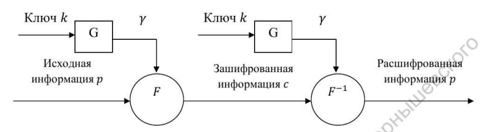

---
## Front matter
title: "Лабораторная работа №3"
subtitle: "Математические основы защиты информации и информационной безопасности"
author: "Данилова Анастасия Сергеевна"

## Generic otions
lang: ru-RU
toc-title: "Содержание"

## Bibliography
bibliography: bib/cite.bib
csl: pandoc/csl/gost-r-7-0-5-2008-numeric.csl

## Pdf output format
toc: true # Table of contents
toc-depth: 2
lof: true # List of figures
lot: true # List of tables
fontsize: 12pt
linestretch: 1.5
papersize: a4
documentclass: scrreprt
## I18n polyglossia
polyglossia-lang:
  name: russian
  options:
	- spelling=modern
	- babelshorthands=true
polyglossia-otherlangs:
  name: english
## I18n babel
babel-lang: russian
babel-otherlangs: english
## Fonts
mainfont: IBM Plex Serif
romanfont: IBM Plex Serif
sansfont: IBM Plex Sans
monofont: IBM Plex Mono
mathfont: STIX Two Math
mainfontoptions: Ligatures=Common,Ligatures=TeX,Scale=0.94
romanfontoptions: Ligatures=Common,Ligatures=TeX,Scale=0.94
sansfontoptions: Ligatures=Common,Ligatures=TeX,Scale=MatchLowercase,Scale=0.94
monofontoptions: Scale=MatchLowercase,Scale=0.94,FakeStretch=0.9
mathfontoptions:
## Biblatex
biblatex: true
biblio-style: "gost-numeric"
biblatexoptions:
  - parentracker=true
  - backend=biber
  - hyperref=auto
  - language=auto
  - autolang=other*
  - citestyle=gost-numeric
## Pandoc-crossref LaTeX customization
figureTitle: "Рис."
tableTitle: "Таблица"
listingTitle: "Листинг"
lofTitle: "Список иллюстраций"
lotTitle: "Список таблиц"
lolTitle: "Листинги"
## Misc options
indent: true
header-includes:
  - \usepackage{indentfirst}
  - \usepackage{float} # keep figures where there are in the text
  - \floatplacement{figure}{H} # keep figures where there are in the text
---

# Цель работы

Изучить шифрование гаммированием, реализовать алгоритм шифрования гаммированием конечной гаммой на языке программирования Julia.

# Задание

- Изучить теоретическую часть о шифровании гаммированием
- Реализовать алгоритм шифрования гаммированием конечной гаммой

# Теоретическое введение

**Гаммирование** - процедура наложения при помощи некоторой функции F на исходный текст гаммы шифра, т.е. псевдослучайной последовательности (ПСП) с выходов генератора G. Псевдослучайная последовательность по своим статистическим свойствам неотличима от случайной последовательности, но является детерминированной, т.е. известен алгоритм ее формирования. Чаще обычно в качестве функции F берется операция поразрядного сложения по модулю два или по модулю N (N - число букв алфавита открытого текста).

Ниже представлена схема, которая называется гаммированием

Стойкость шифров, основанных на процедуре гаммирования, зависит от характеристик гаммы - длины и равномерности распределения вероятностей появления знаков гаммы.
При использовании генератора ПСП получаем бесконечную гамму. Однако, возможен режим шифрования конечной гаммы. В роли конечной гаммы может выступать фраза. Как и ранее, используется алфавитный порядок букв, т.е. буква «а» имеет порядковый номер 1, «б» - 2 и т.д.

# Выполнение лабораторной работы

Итак, реализуем схему шифрования и дешифрования текста, используя ключ-гамму:

Функция encrypt принимает на вход исходный текст и гамму-ключ и возвращает зашифрованный текст:
   - Она преобразует исходный текст в массив числовых кодов
   - Затем шифрует каждый символ текста, используя соответствующий символ из гаммы-ключа
   - Шифрование производится путем сложения числовых кодов символа текста и символа гаммы по модулю 32
   - Полученные символы объединяются в единую строку

Функция decrypt принимает на вход зашифрованный текст и гамму-ключ и возвращает расшифрованный текст:
   - Она проходит по каждому символу зашифрованного текста
   - Для каждого символа производится вычитание числового кода соответствующего символа гаммы-ключа по модулю 32
   - Полученные  символы объединяются в одну строку

# Выводы

Мы изучили шифрование гаммированием, а также реализовали алгоритм шифрования гаммированием конечной гаммой на языке программирования Julia.

# Список литературы{.unnumbered}

1. Mathematics // Julia URL: https://docs.julialang.org/en/v1/base/math/