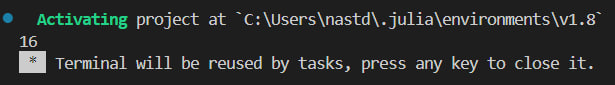
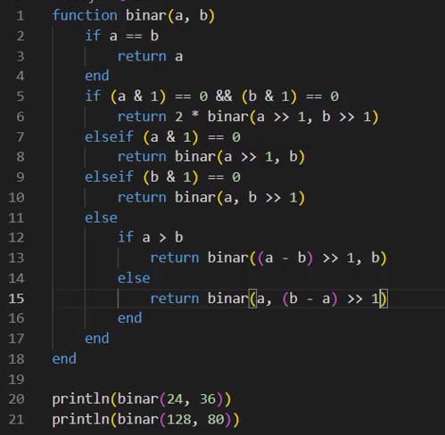

---
## Front matter
title: "Лабораторная работа №4"
subtitle: "Математические основы защиты информации и информационной безопасности"
author: "Данилова Анастасия Сергеевна"

## Generic otions
lang: ru-RU
toc-title: "Содержание"

## Bibliography
bibliography: bib/cite.bib
csl: pandoc/csl/gost-r-7-0-5-2008-numeric.csl

## Pdf output format
toc: true # Table of contents
toc-depth: 2
lof: true # List of figures
lot: true # List of tables
fontsize: 12pt
linestretch: 1.5
papersize: a4
documentclass: scrreprt
## I18n polyglossia
polyglossia-lang:
  name: russian
  options:
	- spelling=modern
	- babelshorthands=true
polyglossia-otherlangs:
  name: english
## I18n babel
babel-lang: russian
babel-otherlangs: english
## Fonts
mainfont: IBM Plex Serif
romanfont: IBM Plex Serif
sansfont: IBM Plex Sans
monofont: IBM Plex Mono
mathfont: STIX Two Math
mainfontoptions: Ligatures=Common,Ligatures=TeX,Scale=0.94
romanfontoptions: Ligatures=Common,Ligatures=TeX,Scale=0.94
sansfontoptions: Ligatures=Common,Ligatures=TeX,Scale=MatchLowercase,Scale=0.94
monofontoptions: Scale=MatchLowercase,Scale=0.94,FakeStretch=0.9
mathfontoptions:
## Biblatex
biblatex: true
biblio-style: "gost-numeric"
biblatexoptions:
  - parentracker=true
  - backend=biber
  - hyperref=auto
  - language=auto
  - autolang=other*
  - citestyle=gost-numeric
## Pandoc-crossref LaTeX customization
figureTitle: "Рис."
tableTitle: "Таблица"
listingTitle: "Листинг"
lofTitle: "Список иллюстраций"
lotTitle: "Список таблиц"
lolTitle: "Листинги"
## Misc options
indent: true
header-includes:
  - \usepackage{indentfirst}
  - \usepackage{float} # keep figures where there are in the text
  - \floatplacement{figure}{H} # keep figures where there are in the text
---

# Цель работы

Изучить различные вариации алгоритма Евклида и реализовать их программно на языке Julia.

# Задание

- Изучить теоретическую часть о способах нахождения НОД
- Реализовать алгоритм Евклида, бинарный алгоритм Евклида, а также их расширенные варианты

# Теоретическое введение

**НОД** (наибольший общий делитель) – это наибольшее натуральное целое число, на которое эти числа делятся без остатка.

*Алгоритм Евклида*

Для нахождения наибольшего общего делителя двух чисел нужно заменить большее из чисел на остаток от деления его на меньшее и для полученной пары повторять эту процедуру, пока одно из чисел не станет равно нулю. Тогда второе число будет равно наибольшему общему делителю исходных чисел. 

*Бинарный Алгоритм Евклида*

Метод нахождения наибольшего общего делителя двух целых чисел. Данный алгоритм «быстрее» обычного алгоритма Евклида, так как вместо медленных операций деления и умножения используются сдвиги. Но это преимущество в скорости теряется с увеличением разницы между целыми числами более чем на несколько порядков, в результате чего число итераций вычитания может многократно превышать число итераций обычного алгоритма, использующего сравнение по модулю. То есть скорость бинарных сдвигов даёт эффект только для чисел, близких друг к другу.

*Расширенный Алгоритм Евклида*

Расширенный алгоритм возвращает не только НОД(a, b), но и коэффициенты x и y. Коэффициенты можно получить, используя рекурсивное свойство алгоритма Евклида.
Уравнение Безу: 
a⋅x+b⋅y=gcd(a,b)

*Расширенный бинарный Алгоритм Евклида*

Расширенный бинарный алгоритм Евклида находит наибольший общий делитель (НОД) двух чисел и определяет два коэффициента x и y, такие что НОД = ax + by.
Иными словами, алгоритм находит наибольший делитель и его линейное представление. 

# Выполнение лабораторной работы

**Алгоритм Евклида**

# Выводы

Мы изучили различные вариации алгоритма Евклида и реализовали их программно на языке Julia.

# Список литературы{.unnumbered}

1. Mathematics // Julia URL: https://docs.julialang.org/en/v1/base/math/