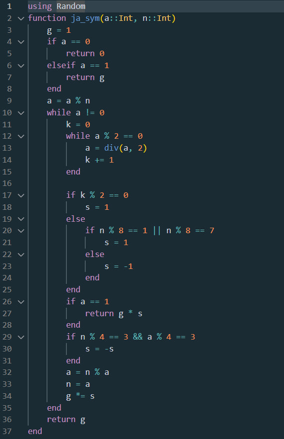

---
## Front matter
title: "Лабораторная работа №5"
subtitle: "Математические основы защиты информации и информационной безопасности"
author: "Данилова Анастасия Сергеевна"

## Generic otions
lang: ru-RU
toc-title: "Содержание"

## Bibliography
bibliography: bib/cite.bib
csl: pandoc/csl/gost-r-7-0-5-2008-numeric.csl

## Pdf output format
toc: true # Table of contents
toc-depth: 2
lof: true # List of figures
lot: true # List of tables
fontsize: 12pt
linestretch: 1.5
papersize: a4
documentclass: scrreprt
## I18n polyglossia
polyglossia-lang:
  name: russian
  options:
	- spelling=modern
	- babelshorthands=true
polyglossia-otherlangs:
  name: english
## I18n babel
babel-lang: russian
babel-otherlangs: english
## Fonts
mainfont: IBM Plex Serif
romanfont: IBM Plex Serif
sansfont: IBM Plex Sans
monofont: IBM Plex Mono
mathfont: STIX Two Math
mainfontoptions: Ligatures=Common,Ligatures=TeX,Scale=0.94
romanfontoptions: Ligatures=Common,Ligatures=TeX,Scale=0.94
sansfontoptions: Ligatures=Common,Ligatures=TeX,Scale=MatchLowercase,Scale=0.94
monofontoptions: Scale=MatchLowercase,Scale=0.94,FakeStretch=0.9
mathfontoptions:
## Biblatex
biblatex: true
biblio-style: "gost-numeric"
biblatexoptions:
  - parentracker=true
  - backend=biber
  - hyperref=auto
  - language=auto
  - autolang=other*
  - citestyle=gost-numeric
## Pandoc-crossref LaTeX customization
figureTitle: "Рис."
tableTitle: "Таблица"
listingTitle: "Листинг"
lofTitle: "Список иллюстраций"
lotTitle: "Список таблиц"
lolTitle: "Листинги"
## Misc options
indent: true
header-includes:
  - \usepackage{indentfirst}
  - \usepackage{float} # keep figures where there are in the text
  - \floatplacement{figure}{H} # keep figures where there are in the text
---

# Цель работы

Изучить вероятностные алгоритмы проверки чисел на простоту и реализовать их программно на языке Julia.

# Задание

- Изучить теоретическую часть о вероятностных алгоритмах проверки чисел на простоту
- Реализовать вычисление символа Якоби и тесты: Ферма, Соловэя-Штрассена, Миллера-Рабина.

# Теоретическое введение

**Тест Ферма**

При проверке числа на простоту тестом Ферма выбирают несколько чисел a. Чем больше количество a, для которых утверждение истинно, тем больше вероятность, что число n простое. Однако существуют составные числа, для которых данное равенство выполняется для всех a взаимно простых с  - это числа Кармайкла. Чисел Кармайкла — бесконечное множество, наименьшее число Кармайкла — 561. Тем не менее, тест Ферма довольно эффективен для обнаружения составных чисел.

**Тест Соловея-Штрассена**

Тест Соловея — Штрассена — вероятностный тест простоты, открытый в 1970-х годах Робертом Мартином Соловеем совместно с Фолькером Штрассеном. Тест всегда корректно определяет, что простое число является простым, но для составных чисел с некоторой вероятностью он может дать неверный ответ. Основное преимущество теста заключается в том, что он, в отличие от теста Ферма, распознает числа Кармайкла как составные.

**Тест Миллера-Рабина**

Тест Миллера — Рабина — вероятностный полиномиальный тест простоты. Тест Миллера — Рабина позволяет эффективно определять, является ли данное число составным. Однако, с его помощью нельзя строго доказать простоту числа. Тем не менее тест Миллера — Рабина часто используется в криптографии для получения больших случайных простых чисел.
Алгоритм был разработан Гари Миллером в 1976 году и модифицирован Майклом Рабином в 1980 году.

**Символ Якоби**

Символ Якоби — теоретико-числовая функция двух аргументов, введённая К. Якоби в 1837 году. Является квадратичным характером в кольце вычетов.

Символ Якоби обобщает символ Лежандра на все нечётные числа, большие единицы. Символ Кронекера — Якоби, в свою очередь, обобщает символ Якоби на все целые числа, но в практических задачах символ Якоби играет гораздо более важную роль, чем символ Кронекера — Якоби.

# Выполнение лабораторной работы

# Выводы

Мы изучили вероятностные алгоритмы проверки чисел на простоту и реализовали их программно на языке Julia.

# Список литературы{.unnumbered}

1. Mathematics // Julia URL: https://docs.julialang.org/en/v1/base/math/