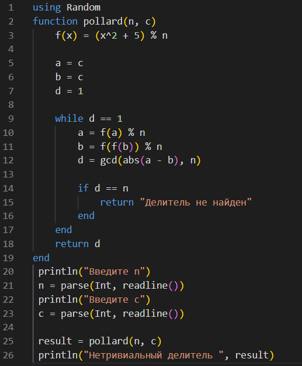
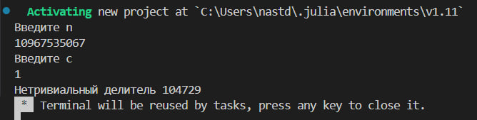
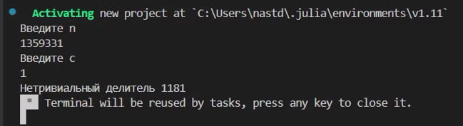
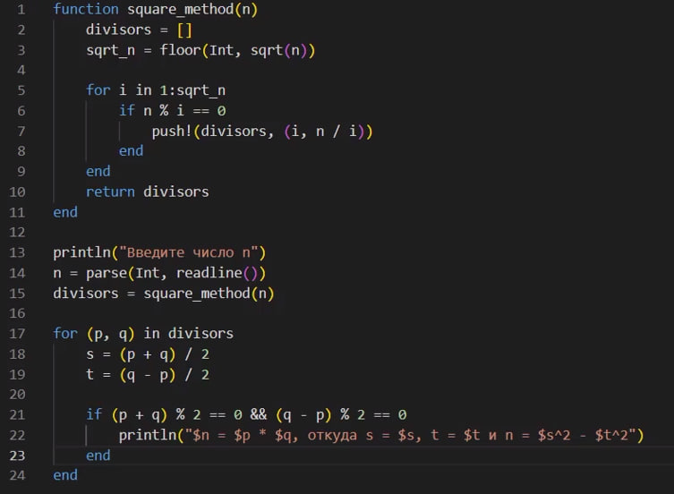

---
## Front matter
lang: ru-RU
title: Разложение чисел на множители
subtitle: Лабораторная работа №6
author:
  - Данилова А.С.

## i18n babel
babel-lang: russian
babel-otherlangs: english

## Formatting pdf
toc: false
toc-title: Содержание
slide_level: 2
aspectratio: 169
section-titles: true
theme: metropolis
header-includes:
 - \metroset{progressbar=frametitle,sectionpage=progressbar,numbering=fraction}
---

## Цели и задачи

- Изучить теоретическую часть об алгоритме, который реализует метод Полларда;
- Изучить метод разложения квадратов на множители(теорема Ферма о разложении);
- Реализовать оба метода программно.

## P-метод Полларда

Ро-алгоритм — предложенный Джоном Поллардом в 1975 году алгоритм, служащий для факторизации (разложения на множители) целых чисел. Алгоритм наиболее эффективен при факторизации составных чисел с достаточно малыми множителями в разложении.

## Метод Квадратов(теорема Ферма о разложении)

Метод квадратов, связанный с теоремой Ферма о разложении, представляет собой эффективный способ работы с целыми числами и обнаружения свойств связи между делителями и квадратами чисел. 
Для каждого нечетного числа мы можем найти пары (s, t), которые позволяют записать число как разность квадратов двух других целых чисел. 

## Выполнение работы

{#fig:001 width=35%}

## Выполнение работы

{#fig:001 width=75%}

## Полученный результат

{#fig:001 width=75%}

## Выполнение работы

{#fig:001 width=50%}

## Полученный результат

{#fig:001 width=75%}

## Выводы

Мы изучили методы разложения чисел на множители и реализовали их программно на языке программмирования Julia.
