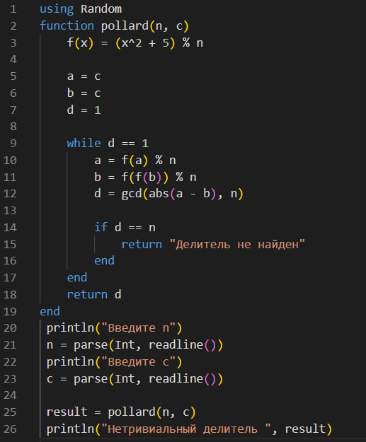
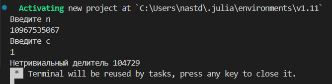
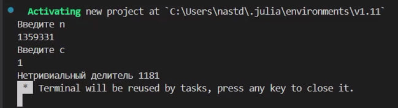
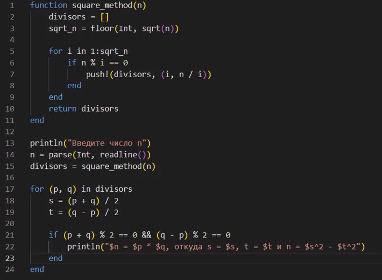
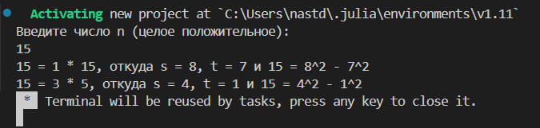

---
## Front matter
title: "Лабораторная работа №6"
subtitle: "Математические основы защиты информации и информационной безопасности"
author: "Данилова Анастасия Сергеевна"

## Generic otions
lang: ru-RU
toc-title: "Содержание"

## Bibliography
bibliography: bib/cite.bib
csl: pandoc/csl/gost-r-7-0-5-2008-numeric.csl

## Pdf output format
toc: true # Table of contents
toc-depth: 2
lof: true # List of figures
lot: true # List of tables
fontsize: 12pt
linestretch: 1.5
papersize: a4
documentclass: scrreprt
## I18n polyglossia
polyglossia-lang:
  name: russian
  options:
	- spelling=modern
	- babelshorthands=true
polyglossia-otherlangs:
  name: english
## I18n babel
babel-lang: russian
babel-otherlangs: english
## Fonts
mainfont: IBM Plex Serif
romanfont: IBM Plex Serif
sansfont: IBM Plex Sans
monofont: IBM Plex Mono
mathfont: STIX Two Math
mainfontoptions: Ligatures=Common,Ligatures=TeX,Scale=0.94
romanfontoptions: Ligatures=Common,Ligatures=TeX,Scale=0.94
sansfontoptions: Ligatures=Common,Ligatures=TeX,Scale=MatchLowercase,Scale=0.94
monofontoptions: Scale=MatchLowercase,Scale=0.94,FakeStretch=0.9
mathfontoptions:
## Biblatex
biblatex: true
biblio-style: "gost-numeric"
biblatexoptions:
  - parentracker=true
  - backend=biber
  - hyperref=auto
  - language=auto
  - autolang=other*
  - citestyle=gost-numeric
## Pandoc-crossref LaTeX customization
figureTitle: "Рис."
tableTitle: "Таблица"
listingTitle: "Листинг"
lofTitle: "Список иллюстраций"
lotTitle: "Список таблиц"
lolTitle: "Листинги"
## Misc options
indent: true
header-includes:
  - \usepackage{indentfirst}
  - \usepackage{float} # keep figures where there are in the text
  - \floatplacement{figure}{H} # keep figures where there are in the text
---

# Цель работы

Изучить методы разложения чисел на множители и реализовать их программно на языке программмирования Julia.

# Задание

- Изучить теоретическую часть об алгоритме, который реализует метод Полларда;
- Изучить метод разложения квадратов на множители(теорема Ферма о разложении);
- Реализовать оба метода программно.

# Теоретическое введение

**P-метод Полларда**

Ро-алгоритм — предложенный Джоном Поллардом в 1975 году алгоритм, служащий для факторизации (разложения на множители) целых чисел. Данный алгоритм основывается на алгоритме Флойда поиска длины цикла в последовательности и некоторых следствиях из парадокса дней рождения. Алгоритм наиболее эффективен при факторизации составных чисел с достаточно малыми множителями в разложении.

**Метод Квадратов(теорема Ферма о разложении)**

Метод квадратов, связанный с теоремой Ферма о разложении, представляет собой эффективный способ работы с целыми числами и обнаружения свойств связи между делителями и квадратами чисел. Это понимание имеет широкие применения в различных теоретических и практических аспектах математического анализа.

Для каждого нечетного числа мы можем найти пары (s, t), которые позволяют записать число как разность квадратов двух других целых чисел. Метод квадратов показывают, что существуют различные способы представления каждого положительного нечетного числа в виде разности квадратов, что делает этот метод полезным в различных задачах теории чисел.

# Выполнение лабораторной работы

# Выводы

Мы изучили методы разложения чисел на множители и реализовали их программно на языке программмирования Julia.

# Список литературы{.unnumbered}

1. Mathematics // Julia URL: https://docs.julialang.org/en/v1/base/math/