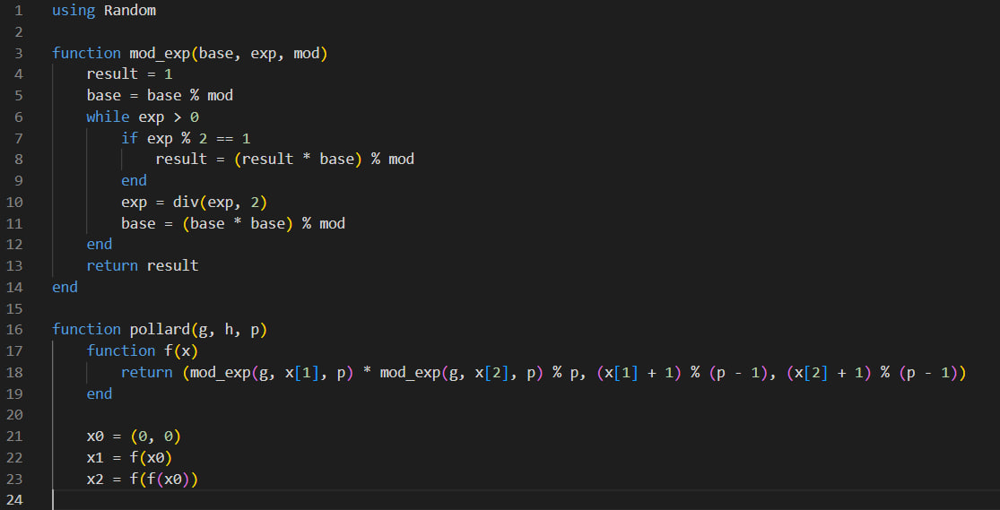

---
## Front matter
lang: ru-RU
title: Дискретное логарифмирование в конечном поле
subtitle: Лабораторная работа №7
author:
  - Данилова А.С.

## i18n babel
babel-lang: russian
babel-otherlangs: english

## Formatting pdf
toc: false
toc-title: Содержание
slide_level: 2
aspectratio: 169
section-titles: true
theme: metropolis
header-includes:
 - \metroset{progressbar=frametitle,sectionpage=progressbar,numbering=fraction}
---

## Цели и задачи

- Изучить теоретическую часть о дискретном логарифмировании;
- Реализовать алгоритм программно.

## P-метод Полларда

Ро-алгоритм — предложенный Джоном Поллардом в 1975 году алгоритм, служащий для факторизации (разложения на множители) целых чисел. Алгоритм наиболее эффективен при факторизации составных чисел с достаточно малыми множителями в разложении.

## Дискретное логарифмирование

Наиболее часто задачу дискретного логарифмирования рассматривают в мультипликативной группе кольца вычетов или конечного поля, а также в группе точек эллиптической кривой над конечным полем. Эффективные алгоритмы для решения задачи дискретного логарифмирования в общем случае неизвестны.

## Выполнение работы

{#fig:001 width=65%}

## Выполнение работы

{#fig:001 width=65%}

## Выполнение работы

## Выполнение работы

{#fig:001 width=75%}

## Выводы

Мы изучили теоретическую часть о дискретном логарифмировании в конечном поле и реализовали алгоритм на языке программмирования Julia.
