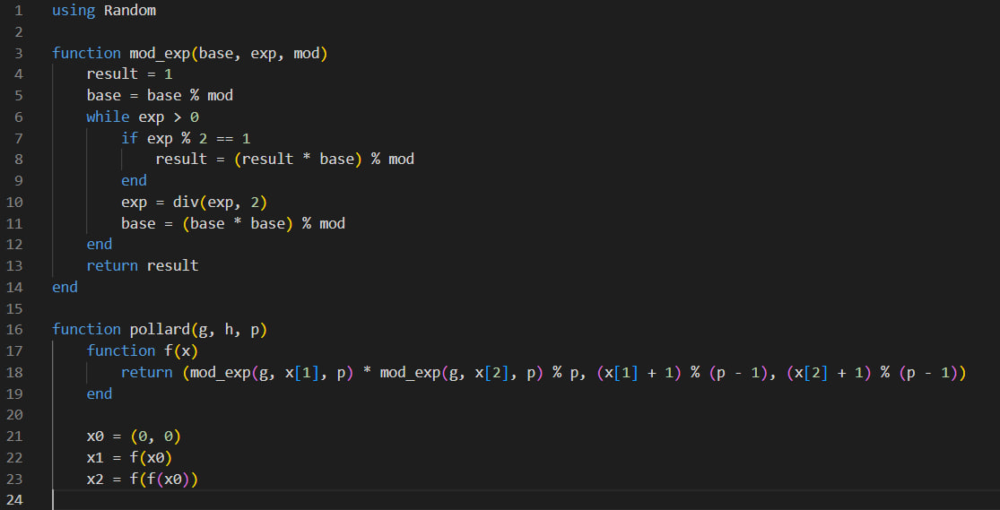
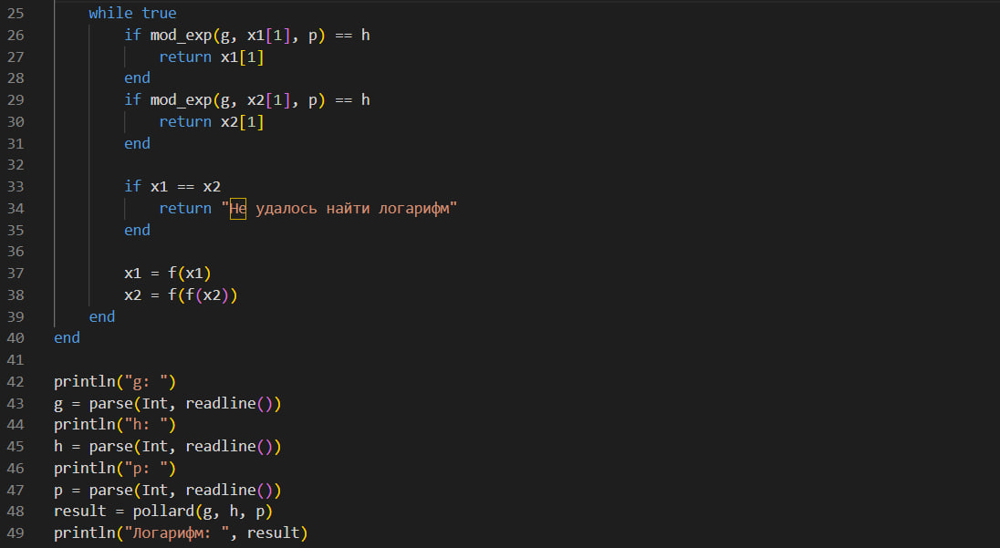
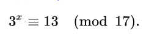

---
## Front matter
title: "Лабораторная работа №7"
subtitle: "Математические основы защиты информации и информационной безопасности"
author: "Данилова Анастасия Сергеевна"

## Generic otions
lang: ru-RU
toc-title: "Содержание"

## Bibliography
bibliography: bib/cite.bib
csl: pandoc/csl/gost-r-7-0-5-2008-numeric.csl

## Pdf output format
toc: true # Table of contents
toc-depth: 2
lof: true # List of figures
lot: true # List of tables
fontsize: 12pt
linestretch: 1.5
papersize: a4
documentclass: scrreprt
## I18n polyglossia
polyglossia-lang:
  name: russian
  options:
	- spelling=modern
	- babelshorthands=true
polyglossia-otherlangs:
  name: english
## I18n babel
babel-lang: russian
babel-otherlangs: english
## Fonts
mainfont: IBM Plex Serif
romanfont: IBM Plex Serif
sansfont: IBM Plex Sans
monofont: IBM Plex Mono
mathfont: STIX Two Math
mainfontoptions: Ligatures=Common,Ligatures=TeX,Scale=0.94
romanfontoptions: Ligatures=Common,Ligatures=TeX,Scale=0.94
sansfontoptions: Ligatures=Common,Ligatures=TeX,Scale=MatchLowercase,Scale=0.94
monofontoptions: Scale=MatchLowercase,Scale=0.94,FakeStretch=0.9
mathfontoptions:
## Biblatex
biblatex: true
biblio-style: "gost-numeric"
biblatexoptions:
  - parentracker=true
  - backend=biber
  - hyperref=auto
  - language=auto
  - autolang=other*
  - citestyle=gost-numeric
## Pandoc-crossref LaTeX customization
figureTitle: "Рис."
tableTitle: "Таблица"
listingTitle: "Листинг"
lofTitle: "Список иллюстраций"
lotTitle: "Список таблиц"
lolTitle: "Листинги"
## Misc options
indent: true
header-includes:
  - \usepackage{indentfirst}
  - \usepackage{float} # keep figures where there are in the text
  - \floatplacement{figure}{H} # keep figures where there are in the text
---

# Цель работы

Изучить дискретное логарифмирование в конечном поле и реализовать алгоритм программно на языке программмирования Julia.

# Задание

- Изучить теоретическую часть о дискретном логарифмировании;
- Реализовать алгоритм программно.

# Теоретическое введение

**P-метод Полларда**

Ро-алгоритм — предложенный Джоном Поллардом в 1975 году алгоритм, служащий для факторизации (разложения на множители) целых чисел. Данный алгоритм основывается на алгоритме Флойда поиска длины цикла в последовательности и некоторых следствиях из парадокса дней рождения. Алгоритм наиболее эффективен при факторизации составных чисел с достаточно малыми множителями в разложении.

**Дискретное логарифмирование**

Дискретное логарифмирование (DLOG) — задача обращения функции 
g^x в некоторой конечной мультипликативной группе G.

Наиболее часто задачу дискретного логарифмирования рассматривают в мультипликативной группе кольца вычетов или конечного поля, а также в группе точек эллиптической кривой над конечным полем. Эффективные алгоритмы для решения задачи дискретного логарифмирования в общем случае неизвестны.

Для заданных g и a решение x уравнения 
g^x = a
называется дискретным логарифмом элемента a по основанию g. В случае, когда G является мультипликативной группой кольца вычетов по модулю m, решение называют также индексом числа a по основанию g. Индекс числа a по основанию g гарантированно существует, если g является первообразным корнем по модулю m.

# Выполнение лабораторной работы

# Выводы

Мы изучили теоретическую часть о дискретном логарифмировании в конечном поле и реализовали алгоритм на языке программмирования Julia.

# Список литературы{.unnumbered}

1. Mathematics // Julia URL: https://docs.julialang.org/en/v1/base/math/