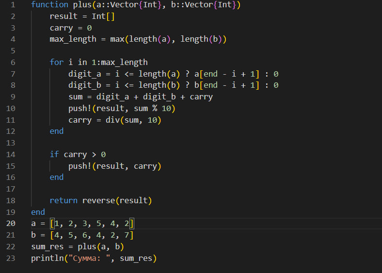
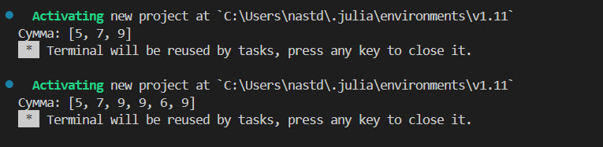
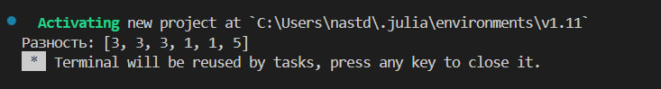
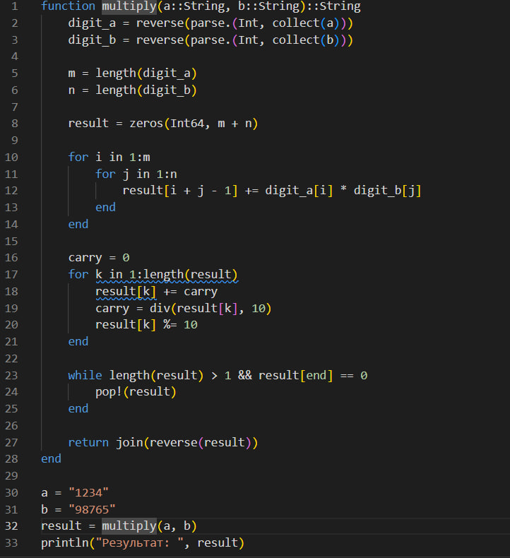
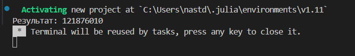

---
## Front matter
lang: ru-RU
title: Целочисленная арифметика многократной точности
subtitle: Лабораторная работа №8
author:
  - Данилова А.С.

## i18n babel
babel-lang: russian
babel-otherlangs: english

## Formatting pdf
toc: false
toc-title: Содержание
slide_level: 2
aspectratio: 169
section-titles: true
theme: metropolis
header-includes:
 - \metroset{progressbar=frametitle,sectionpage=progressbar,numbering=fraction}
---

## Цели и задачи

- Изучить теоретическую часть о предложенных алгоритмах;
- Реализовать алгоритмы программно.

## Целочисленная арифметика многократной точности

Целочисленная арифметика многократной точности — это алгоритмы для выполнения арифметических операций с большими целыми числами.

## Примеры алгоритмов

1. Сложение неотрицательных целых чисел
2. Вычитание неотрицательных целых чисел
3. Умножение неотрицательных целых чисел столбиком
4. Быстрый столбик
5. Деление многоразрядных целых чисел

## Выполнение работы

{#fig:001 width=45%}

## Полученный результат

{#fig:001 width=75%}

## Выполнение работы

{#fig:001 width=45%}

## Полученный результат

{#fig:001 width=75%}

## Выполнение работы

{#fig:001 width=50%}

## Полученный результат

## Выполнение работы

{#fig:001 width=35%}

## Полученный результат

{#fig:001 width=75%}

## Выводы

Мы изучили 5 алгоритмов целочисленной арифметики многократной точности и реализовали их программно на языке программмирования Julia.
