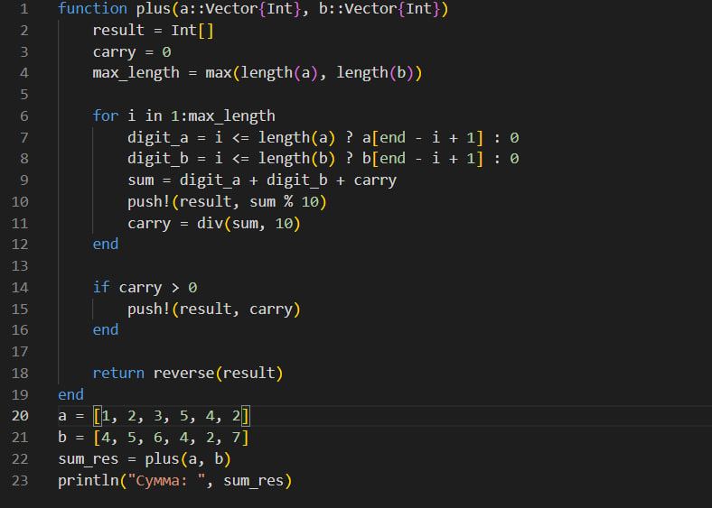
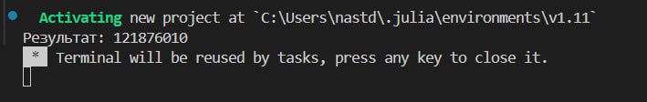

---
## Front matter
title: "Лабораторная работа №8"
subtitle: "Математические основы защиты информации и информационной безопасности"
author: "Данилова Анастасия Сергеевна"

## Generic otions
lang: ru-RU
toc-title: "Содержание"

## Bibliography
bibliography: bib/cite.bib
csl: pandoc/csl/gost-r-7-0-5-2008-numeric.csl

## Pdf output format
toc: true # Table of contents
toc-depth: 2
lof: true # List of figures
lot: true # List of tables
fontsize: 12pt
linestretch: 1.5
papersize: a4
documentclass: scrreprt
## I18n polyglossia
polyglossia-lang:
  name: russian
  options:
	- spelling=modern
	- babelshorthands=true
polyglossia-otherlangs:
  name: english
## I18n babel
babel-lang: russian
babel-otherlangs: english
## Fonts
mainfont: IBM Plex Serif
romanfont: IBM Plex Serif
sansfont: IBM Plex Sans
monofont: IBM Plex Mono
mathfont: STIX Two Math
mainfontoptions: Ligatures=Common,Ligatures=TeX,Scale=0.94
romanfontoptions: Ligatures=Common,Ligatures=TeX,Scale=0.94
sansfontoptions: Ligatures=Common,Ligatures=TeX,Scale=MatchLowercase,Scale=0.94
monofontoptions: Scale=MatchLowercase,Scale=0.94,FakeStretch=0.9
mathfontoptions:
## Biblatex
biblatex: true
biblio-style: "gost-numeric"
biblatexoptions:
  - parentracker=true
  - backend=biber
  - hyperref=auto
  - language=auto
  - autolang=other*
  - citestyle=gost-numeric
## Pandoc-crossref LaTeX customization
figureTitle: "Рис."
tableTitle: "Таблица"
listingTitle: "Листинг"
lofTitle: "Список иллюстраций"
lotTitle: "Список таблиц"
lolTitle: "Листинги"
## Misc options
indent: true
header-includes:
  - \usepackage{indentfirst}
  - \usepackage{float} # keep figures where there are in the text
  - \floatplacement{figure}{H} # keep figures where there are in the text
---

# Цель работы

Изучить алгоритмы целочисленной арифметики многократной точности и реализовать их программно на языке программмирования Julia.

# Задание

- Изучить теоретическую часть о предложенных алгоритмах;
- Реализовать алгоритмы программно.

# Теоретическое введение

**Целочисленная арифметика многократной точности**

Мы считаем, что числа записаны в b-ичной системе счисления, где b — фиксированное натуральное число, b >= 2. При этом натуральное число, записываемое не более чем n цифрами в b-ичной системе счисления, мы обозначаем u1 ... un (допуская, что несколько старших разрядов u1, ... , uk могут равняться нулю). Основание b не всегда
равно 2; иногда оно соответствует размеру машинного слова, отведенному под запись обычных целых чисел. В этом случае мы работаем c массивом, содержащим большое целое число.
При работе с большими целыми числами удобно хранить знак такого числа в отдельной ячейке или переменной. Если мы хотим, например, перемножить два числа, то знак произведения мы вычисляем отдельно.

Рассмотрим 5 алгоритмов:

1. Сложение неотрицательных целых чисел
2. Вычитание неотрицательных целых чисел
3. Умножение неотрицательных целых чисел столбиком
4. Быстрый столбик
5. Деление многоразрядных целых чисел

# Выполнение лабораторной работы

# Выводы

Мы изучили 5 алгоритмов целочисленной арифметики многократной точности и реализовали их программно на языке программмирования Julia.

# Список литературы{.unnumbered}

1. Mathematics // Julia URL: https://docs.julialang.org/en/v1/base/math/